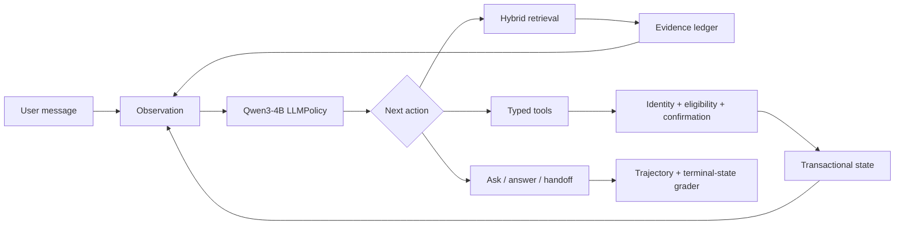

# Trusted E-commerce Tool Agent

> A multi-turn LLM agent with hybrid retrieval, typed tools, transactional guardrails, and state-based evaluation.

The recommended Agent v2 path now uses OpenAI-compatible native function calling
(`tools` / `message.tool_calls`) and converts provider actions into the existing
`AgentAction` contract. System-owned identity is injected after generation, so
native tools cannot bypass action constraints or transactional guardrails. The
same guarded retail tools are also available through MCP.

本项目构建了一个面向动态电商业务的可信工具型 Agent。Qwen3-4B 根据当前 observation 自主选择检索、工具调用、追问、回答或转人工；RAG 负责提供商品与政策事实，typed tools 负责查询和修改订单状态，guardrails 在执行层保护高风险写操作。

## Agent loop



典型退货任务由多轮状态推进完成：请求验证码 → 查询订单 → 检查退货资格 → 请求显式确认 → 创建退货请求 → 根据工具结果回答。模型负责选择下一行动，但不能绕过工具 schema 或写操作 guardrail。

## Core capabilities

### Agent decisions and multi-turn execution

- `LLMPolicy` 基于对话、工具结果和业务状态生成结构化 next action；
- 支持检索、typed tools（含 τ³ 对齐的写工具面）、用户追问、最终回答和转人工；
- 保存完整 `Trajectory`，支持 run、replay、compare 和离线重评分。

### Dynamic facts and business tools

- 商品与政策事实来自 Dense + BM25 + RRF hybrid retrieval；
- 用户、订单、退货资格和写操作来自事务数据库与 typed tools；
- evidence ledger 将工具结果转换为可追踪的原子证据，模型不充当动态数据库。

### Safety and state-based evaluation

- 身份验证、业务资格和显式确认共同保护退货写操作；
- JSON Schema 在执行前验证工具名、参数类型、枚举和内部商品 ID；
- 分开评估模型是否合规，以及 guardrail 是否成功保护数据库终态。

## Agent evaluation

Qwen3-4B 在固定的 120 个任务上确定性运行 3 次，共形成 360 条真实工具轨迹。

| v2 automated operational metric | All | Dev | Locked |
|---|---:|---:|---:|
| Operational success | 84.17% | 83.33% | 85.00% |
| Policy compliance | 95.00% | 95.00% | 95.00% |
| Terminal-state accuracy | 100% | 100% | 100% |
| Forbidden-tool attempt | 5.00% | 5.00% | 5.00% |
| Illegal state change | 0% | 0% | 0% |

这些是自动化操作指标，不是最终回答的人类语义成功率。5% 的轨迹仍尝试了禁止工具，但执行层将非法状态变更保持为 0；这正是“模型决策合规”与“系统终态安全”必须分开报告的原因。详见 [evaluation](docs/evaluation.md)。

## Fact retrieval

固定 revision 的 Amazon Reviews 2023 语料包含 5,000 个商品、5 份政策文档和 43,953 个检索子块。

| Protocol | Recall@1 | Recall@5 | nDCG@5 | P95 |
|---|---:|---:|---:|---:|
| 5k hybrid scale set | 0.9542 | 0.9917 | 0.9826 | 125.73 ms |
| Hybrid + constraints | 0.9542 | 0.9917 | 0.9826 | 108.37 ms |
| + BGE reranker | 0.9750 | 0.9958 | 0.9958 | 219.12 ms |

Reranker 改善首位排序但延迟约翻倍，因此不默认启用。独立困难集 Recall@5 为 0.6889，typo/alias 和 no-answer 仍是明确边界。详见 [retrieval](docs/retrieval.md)。

## Quick start

```powershell
python -m venv .venv
.\.venv\Scripts\pip install -r requirements-dev.txt

python -m ecommerce_rag.harness run `
  --tasks ecommerce_rag/data/harness_smoke.jsonl `
  --db logs/demo_agent.db `
  --store logs/demo_trajectories.sqlite `
  --output logs/demo_report.json `
  --policy rule `
  --repeats 1 `
  --seed-db

python -m pytest tests -q
```

### Native function-calling Agent

Serve Qwen3 with vLLM using the model's Hermes tool protocol:

```text
--enable-auto-tool-choice --tool-call-parser hermes
```

Then configure `ARAG_LLM_BASE_URL`, `ARAG_LLM_MODEL`, and
`ARAG_LLM_API_KEY`, and run the existing harness with the native provider
adapter:

```powershell
python -m ecommerce_rag.harness run `
  --tasks ecommerce_rag/data/harness_smoke.jsonl `
  --db logs/native_agent.db `
  --store logs/native_trajectories.sqlite `
  --output logs/native_report.json `
  --policy native `
  --repeats 1 `
  --seed-db
```

`request_user_input` and `handoff_to_human` are provider-facing control tools.
They map back to internal ask/handoff actions; business tool execution remains
inside the harness.

### Guarded MCP server

The MCP server injects `ERAG_MCP_USER_ID` on the server side and delegates every
call to `RetailTools.call()`. Identity, eligibility, explicit confirmation, and
idempotency therefore remain enforced for MCP clients.

`ERAG_MCP_USER_ID` is required at startup; it is never accepted as a client tool
argument. `ERAG_MCP_INDEX` is optional for a transaction-only server and, when
set, must point to an index built by `scripts.build_retrieval_index`.

```powershell
$env:ERAG_MCP_DB = "logs/demo_agent.db"
$env:ERAG_MCP_USER_ID = "U0001"
$env:ERAG_MCP_TRANSPORT = "stdio"
python -m ecommerce_rag.mcp_server
```

Use `streamable-http` instead of `stdio` for an HTTP MCP endpoint.

### Context compaction baseline

Native Agent requests compact repeated tool payloads without changing the stored
trajectory. On the completed Retail Base 160 trajectories, offline replay of
stored message content reduced cumulative history characters by **16.38%**.
The historical uncompressed baseline was 85,485 prompt tokens and 28.66 seconds
of agent generation per task on average. The character reduction is exact; new
prompt-token, latency, and task-success results require a paired live native run
and are not claimed by the offline measurement.

```powershell
python -m scripts.measure_context_compaction <results.json>
```

运行真实 LLM policy 前复制 `.env.example` 并配置本地模型或 OpenAI-compatible endpoint。完整命令见 [reproduction](docs/reproduction.md)。

## Repository map

- `ecommerce_rag/harness.py`：正式 Agent run/replay/compare 入口；
- `ecommerce_rag/agent_runtime.py`：native function-calling runtime；
- `ecommerce_rag/process_audit.py`：通用 trajectory/process auditor；
- `ecommerce_rag/tau3_retail_v1.py`：官方 τ²/τ³ Retail evaluation wrapper；
- `ecommerce_rag/context_compaction.py`：loss-aware tool-history compaction；
- `ecommerce_rag/mcp_server.py`：guarded MCP tool server；
- `ecommerce_rag/tools.py`：业务工具与 guardrails；
- `ecommerce_rag/tool_schema.py`：typed tool contracts；
- `scripts/`、`nscc/`：数据、评测与集群复现入口；
- `docs/`：当前状态、架构、安全、评测和检索。详见 [current status](docs/current_status.md)。

当前主线是 Reliable Ecommerce Agent：runtime / tool use、RAG、Harness 与 failure attribution、官方 τ²/τ³ evaluation、context/memory、transactional guardrails、MCP。Post-training 方向是 on-policy rollout、rejection sampling / RFT 与 GRPO；这些训练循环尚未作为本仓库已完成能力宣称。

## Boundaries

- 本项目是可复现实验环境，不是生产部署；
- 自动操作评分不覆盖最终回答的全部事实、完整性和推荐质量；
- 40 条审核样本不是随机总体样本，不外推为 360 条的人类成功率；
- 确定性三次重复不解释为独立随机试验的 pass³；
- 当前主线不宣称已完成 DPO、PPO、GRPO 或 Agent RL。

## Task Closure (legacy return-resolution)

在 Agent v2 冻结之后，return-resolution 任务闭环按责任层推进，正式 dev 结果为：

| Protocol | Result | Ownership of gain |
|---|---|---|
| `legacy_progress_fixed` archive | 34/40 | prior baseline |
| `legacy_task_closure_protocol_fix_dev_v1` | 38/40 | protocol / tool contract |
| `legacy_task_closure_action_constraint_dev_v1` | 40/40 | runtime action contract |

Gains through 40/40 are **not** claimed as base-model training. The concise
evolution record and all closed outcomes are listed in [project history](docs/history.md).

早期 RAG/Streamlit demo、terminal-grounding、verifier、SQL Memory probe、相关脚本和 closeout 已迁至独立私有归档仓库。它们不再占据当前 import path，也不作为当前能力列表；公开结论保留在 [project history](docs/history.md)。原始 Agent v2 实验树仍可由 [`agent-v2-raw`](https://github.com/Amay810/ecommerce-agentic-rag/tree/agent-v2-raw) 恢复；发布树资产 SHA-256 见 [release manifest](docs/release_manifest_agent_v2.json)。
