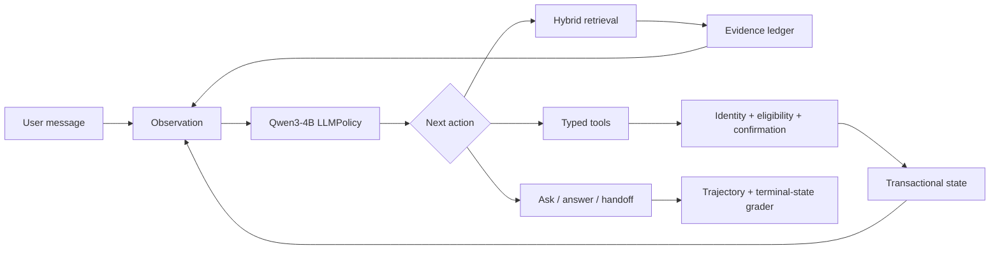

# Trusted E-commerce Tool Agent

> A multi-turn LLM agent with hybrid retrieval, typed tools, transactional guardrails, and state-based evaluation.

本项目构建了一个面向动态电商业务的可信工具型 Agent。Qwen3-4B 根据当前 observation 自主选择检索、工具调用、追问、回答或转人工；RAG 负责提供商品与政策事实，typed tools 负责查询和修改订单状态，guardrails 在执行层保护高风险写操作。

## Agent loop



典型退货任务由多轮状态推进完成：请求验证码 → 查询订单 → 检查退货资格 → 请求显式确认 → 创建退货请求 → 根据工具结果回答。模型负责选择下一行动，但不能绕过工具 schema 或写操作 guardrail。

## Core capabilities

### Agent decisions and multi-turn execution

- `LLMPolicy` 基于对话、工具结果和业务状态生成结构化 next action；
- 支持检索、8 类 typed tools、用户追问、最终回答和转人工；
- 保存完整 `Trajectory`，支持 run、replay、compare 和离线重评分。

### Dynamic facts and business tools

- 商品与政策事实来自 Dense + BM25 + RRF hybrid retrieval；
- 用户、订单、退货资格和写操作来自事务数据库与 typed tools；
- evidence ledger 将工具结果转换为可追踪的原子证据，模型不充当动态数据库。

### Safety and state-based evaluation

- 身份验证、业务资格和显式确认共同保护退货写操作；
- JSON Schema 在执行前验证工具名、参数类型、枚举和内部商品 ID；
- 分开评估模型是否合规，以及 guardrail 是否成功保护数据库终态。

## Agent evaluation

Qwen3-4B 在固定的 120 个任务上确定性运行 3 次，共形成 360 条真实工具轨迹。

| v2 automated operational metric | All | Dev | Locked |
|---|---:|---:|---:|
| Operational success | 84.17% | 83.33% | 85.00% |
| Policy compliance | 95.00% | 95.00% | 95.00% |
| Terminal-state accuracy | 100% | 100% | 100% |
| Forbidden-tool attempt | 5.00% | 5.00% | 5.00% |
| Illegal state change | 0% | 0% | 0% |

这些是自动化操作指标，不是最终回答的人类语义成功率。5% 的轨迹仍尝试了禁止工具，但执行层将非法状态变更保持为 0；这正是“模型决策合规”与“系统终态安全”必须分开报告的原因。详见 [evaluation](docs/evaluation.md)。

## Fact retrieval

固定 revision 的 Amazon Reviews 2023 语料包含 5,000 个商品、5 份政策文档和 43,953 个检索子块。

| Protocol | Recall@1 | Recall@5 | nDCG@5 | P95 |
|---|---:|---:|---:|---:|
| 5k hybrid scale set | 0.9542 | 0.9917 | 0.9826 | 125.73 ms |
| Hybrid + constraints | 0.9542 | 0.9917 | 0.9826 | 108.37 ms |
| + BGE reranker | 0.9750 | 0.9958 | 0.9958 | 219.12 ms |

Reranker 改善首位排序但延迟约翻倍，因此不默认启用。独立困难集 Recall@5 为 0.6889，typo/alias 和 no-answer 仍是明确边界。详见 [retrieval](docs/retrieval.md)。

## Terminal-grounding extension

terminal-grounding v2 在保持 action、tool calls、evidence ledger 和数据库终态不变的前提下重写最终答案。冻结 40-task Codex 盲审中，base 与 grounded 的 fact pass 均为 34/40，配对差值为 0，95% bootstrap CI 为 `[-7.5pp, +7.5pp]`。

该实验正式关闭为 `negative_or_inconclusive`，不解释为质量提升，也没有继续 v3、verifier、SFT 或 DPO。详见 [closeout](docs/answer_postprocess_blind_audit_v1_closeout.md)。

## Quick start

```powershell
python -m venv .venv
.\.venv\Scripts\pip install -r requirements-dev.txt

python -m ecommerce_rag.harness run `
  --tasks ecommerce_rag/data/harness_smoke.jsonl `
  --db logs/demo_agent.db `
  --store logs/demo_trajectories.sqlite `
  --output logs/demo_report.json `
  --policy rule `
  --repeats 1 `
  --seed-db

python -m pytest -q
```

运行真实 LLM policy 前复制 `.env.example` 并配置本地模型或 OpenAI-compatible endpoint。完整命令见 [reproduction](docs/reproduction.md)。

## Repository map

- `ecommerce_rag/harness.py`：正式 Agent run/replay/compare 入口；
- `ecommerce_rag/llm_policy.py`：结构化 next-action policy；
- `ecommerce_rag/tools.py`：业务工具与 guardrails；
- `ecommerce_rag/tool_schema.py`：typed tool contracts；
- `scripts/`、`nscc/`：数据、评测与集群复现入口；
- `docs/`：架构、安全、评测、检索和发布证据。

`ecommerce_rag.app` 与 `CustomerSupportAgent` 是早期 retrieval-oriented demo，保留用于旧回归链路，不再作为正式 Agent v2 入口。

## Boundaries

- 本项目是可复现实验环境，不是生产部署；
- 自动操作评分不覆盖最终回答的全部事实、完整性和推荐质量；
- 40 条审核样本不是随机总体样本，不外推为 360 条的人类成功率；
- 确定性三次重复不解释为独立随机试验的 pass³；
- RL gate 未通过，项目不宣称完成 DPO、PPO、GRPO 或 Agent RL。

原始实验历史、SQLite、sidecar 和中间报告冻结在 [`agent-v2-raw`](https://github.com/Amay810/ecommerce-agentic-rag/tree/agent-v2-raw)。发布树移除资产及 SHA-256 记录在 [release manifest](docs/release_manifest_agent_v2.json)。
