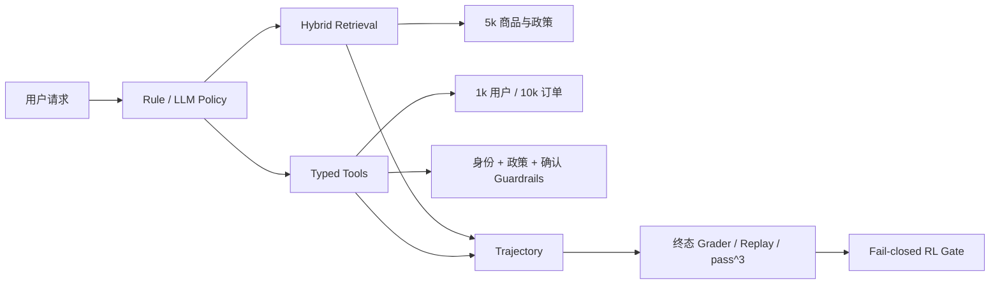

# 电商客服可信 Agentic RAG

这是一个可评测、可重放的电商客服 Agent 环境，而不是只有
`Embedding → Vector DB → LLM` 的教程 Demo。项目覆盖 5,000 商品检索、
10,000 订单状态、八类工具、写操作安全约束、轨迹回放、数据库终态评分和
fail-closed RL 门槛。

当前结论保持克制：正式规模检索与 Rule Policy Harness 已完成；困难检索、
人工审核和真实 LLMPolicy 尚未全部通过，因此不宣称完成 Agent RL。

## 系统结构



## 主要能力

- Hybrid Retrieval：多语言 dense embedding + 稀疏 BM25 + RRF；
- 商品父卡与描述、属性、评价、QA 子块；
- 预算约束过滤、复合实体分解、可选 BGE reranker；
- 八个工具：商品搜索、商品详情、比较、政策、订单、退货资格、创建退货、转人工；
- 1,000 用户和 10,000 订单的确定性模拟数据库；
- 修改型工具必须通过身份、政策资格和显式确认；
- TaskSpec、AgentObservation、ToolCall、Trajectory、GradeResult 公共契约；
- run、replay、compare、终态差异、失败分类和 pass@1/pass³；
- Oracle、Rule 和 LLM Policy 分开报告，禁止 gold TaskSpec 泄漏给普通策略。

## 目录

```text
ecommerce-agentic-rag/
├─ ecommerce_rag/          # Agent、检索、工具、订单环境、Harness、Grader
│  └─ data/                # 小型样例与可提交评测集；5k 原始语料不提交 Git
├─ scripts/                # 数据、holdout、审核、轨迹和偏好对生成
├─ nscc/                   # NSCC PBS、模型缓存和正式实验入口
├─ tests/                  # 路由、Guardrail、终态、引用与 fail-closed 测试
├─ docs/                   # 正式结果、报告、审核表与简历材料
└─ logs/                   # 本地轨迹数据库；默认不提交 Git
```

更细的保留、归档和可再生文件说明见
[目录与清理清单](docs/DIRECTORY_AND_CLEANUP.md)。

## 数据

- 来源：Amazon Reviews 2023，固定 revision
  `2b6d039ed471f2ba5fd2acb718bf33b0a7e5598e`；
- 2,500 Electronics + 2,500 Home and Kitchen；
- 5,000 商品、1,125 条有效评价、43,953 个检索子块；
- 商品事实保留英文，查询侧加入中文类别与属性别名；
- 5k 语料 SHA-256：
  `87e0f8a63a314d550dd6e68fa36ee8ae0cca492d037419215a5c9a702018c6a1`。

## 正式规模检索（NSCC FAISS）

同一 250-query scale set 在增加 distractor 商品时保持 gold 商品不变。

| 商品 | Recall@1 | Recall@5 | nDCG@5 | P50 | P95 | 索引大小 |
|---:|---:|---:|---:|---:|---:|---:|
| 40 | 0.9583 | 1.0000 | 0.9901 | 9.44 ms | 9.96 ms | 1.58 MB |
| 1,000 | 0.9625 | 0.9958 | 0.9888 | 20.52 ms | 28.93 ms | 37.30 MB |
| 5,000 | 0.9542 | 0.9917 | 0.9826 | 79.59 ms | 125.73 ms | 185.52 MB |

### Reranker 消融

| 5k 配置 | Recall@1 | Recall@5 | nDCG@5 | P95 |
|---|---:|---:|---:|---:|
| Hybrid + constraints | 0.9542 | 0.9917 | 0.9826 | 108.37 ms |
| + BGE reranker | 0.9750 | 0.9958 | 0.9958 | 219.12 ms |

Reranker 改善 top-rank 与 nDCG，但 Recall@5 仅增加 0.0041，P95 约翻倍，
因此不默认开启；适合在高价值比较或复杂约束请求上条件触发。

## 困难检索与负结果

scale set 用于规模与消融，不代表真实模糊查询上同样容易。去完整标题的 v2
locked set 得到：

| 配置 | Recall@5 | MRR | nDCG@5 | no-answer accuracy | P95 |
|---|---:|---:|---:|---:|---:|
| Hybrid + constraints | 0.8029 | 0.6246 | 0.6539 | 0.00 | 33.53 ms |
| + dev 阈值 0.65 | 0.4964 | 0.3926 | 0.4085 | 0.75 | 33.50 ms |

简单 dense 阈值虽然改善拒答，却误拒绝大量有答案问题，因此不启用。

在修复 28 题排序后生成的全新 v3 150-query holdout 得到 Recall@5=0.6889：
多约束和 near-SKU Recall@5 均为 1.0，但纯属性为 0.6625、错别字为 0.25，
无答案仍为 0。这是保留的负结果，说明困难检索仍是主要瓶颈。

## Agent Harness

120 个隐藏任务按 dev/locked 各 60 条。普通策略只接收 AgentObservation，
不能读取 category、gold 文档、允许工具或期望终态。

| Policy | Gold access | Task success | pass³ | Tool F1 | Compliance | Terminal state |
|---|---:|---:|---:|---:|---:|---:|
| Oracle upper bound | 是 | 1.000 | 1.000 | 0.944 | 1.000 | 1.000 |
| Rule Policy（NSCC） | 否 | 0.950 | 0.950 | 0.917 | 1.000 | 1.000 |
| LLM next-action（Qwen3-4B） | 否 | invalid run | invalid run | invalid run | invalid run | invalid run |

Rule Policy 的 9 次失败来自 3 个政策任务重复 3 次：物流/退款歧义词被错误地
优先解释为个人订单或退货。修复“明确政策语言优先”后，新的 routing v3
30-query holdout 达到 30/30；原 locked 结果仍保留，不把修复后的重复运行冒充
未见测试。

Rule Policy 的 0.950 是**确定性规则系统的环境与评分器基线**，用于验证环境、
工具与 grader 正确，不代表 Agent 泛化能力：任务生成器与规则策略共用高度一致
的关键词模板，dev/locked 只更换订单与商品实体，未改变语言分布。

### LLM next-action：首轮接入失败（invalid integration run）

已在 NSCC 跑完 360 条 LLMPolicy 轨迹（Qwen3-4B-Instruct-2507，dev 60×3 +
locked 60×3），结果**不可用于评价模型能力**：

- 360/360 条轨迹发生 `model_action_parse_failure`，随后全部退化为
  `escalate_to_human`；
- 汇总数字（task success 0.1667）来自本来就应转人工的 safety 任务，等价于
  “永远转人工”的退化基线，不是模型能力测量；
- `policy_compliance = 1.000` 同样无意义：一个不调用任何工具的策略当然不会
  触碰禁用工具；
- 失败分类被记为 `{retrieval, wrong-tool, recovery}`，是 `classify_failure()`
  缺少 parse 桶导致的误归因，真实原因 100% 是动作协议解析失败；
- trace 未保存模型原始输出与解析尝试，因此**无法判断**问题出在 prompt、chat
  template、输出格式还是 parser。

原始结果与轨迹全部保留（`docs/harness_v2_llm_*_pass3.json`、
`logs/harness_v2_llm_360.sqlite`），并在汇总 JSON 中标记 `run_validity`。
重跑前的前置条件：trace 记录 raw output + 解析尝试 + fallback 原因，先跑
5–10 条 smoke 确认动作可解析且工具真正执行，再扩到 360 条。

## 原 28 题回归

NSCC 复建索引结果为 Recall@1=0.889、Recall@5=1.000、MRR=0.963。
失败定位到自然语言 RRF tie-break 过弱和显式比较实体没有优先排序。通用修复后，
本地完整 28 题恢复到 Recall@1=0.944、Recall@3/5=1.000、MRR=1.000；
该修复仍需一次 NSCC confirmation run。

## RL 决策

当前 RL gate 为 `eligible=false`。Oracle/Rule 轨迹不能代替真实模型轨迹，因此
当前只声明“RL-ready Harness”，不声明 Agent RL、DPO 或策略训练。

[run_llm_policy_v2.pbs](nscc/run_llm_policy_v2.pbs) 已执行，产出 360 条轨迹，
但该批次为 invalid integration run（见上节），不计入有效 LLM baseline。
未通过的门槛项：

| 门槛 | 状态 | 说明 |
|---|---|---|
| `real_llm_trajectories_at_least_360` | 计数达标但内容无效 | 360 条全为解析失败，gate 目前只检查行数、无质量下限 |
| `human_audit_at_least_40` | false | `trajectory_audit_40.csv` 有 40 行模板，人工判定列 **0 行已填** |
| `human_reward_agreement_at_least_90pct` | false | agreement = `null`（尚未开始人工裁决，不是人机不一致） |
| `preference_pairs_at_least_200` | false | 0 对；只输出单一动作的策略无法构造偏好对 |

注：`deterministic_graders` 与 `policy_input_isolated` 两项目前是形式检查
（前者只校验字段是否为布尔值，后者只检查 observation 顶层字段名），尚未构成
真实的数据流验证，不应作为无泄漏的最终证据；真正有效的证据是
`tests/test_harness_tools.py::test_policy_observation_excludes_hidden_gold`。

## 本地快速回归

```powershell
python -m unittest discover -s tests -v
python -m ecommerce_rag.data_loader
python -m ecommerce_rag.evaluate --index ecommerce_rag/index
```

不配置 API key 也能运行数据、检索、Rule Policy、工具安全和确定性评分。

## NSCC 入口

必须从真实仓库根目录提交：

```bash
cd /scratch/users/ntu/s250045/ecommerce-agentic-rag-git

# 规模实验
qsub nscc/build_5k_and_benchmark.pbs

# 仅测三档索引构建时间
qsub nscc/measure_index_builds.pbs

# 原 28 题确认
qsub nscc/run_regression_only.pbs

# 生成 50 条困难检索可审核证据面板
qsub nscc/build_retrieval_audit_evidence.pbs

# 360 条真实 LLMPolicy 轨迹；使用已存在的 Qwen3-4B-Instruct-2507
qsub nscc/run_llm_policy_v2.pbs
```

## 边界

- 不是生产部署，也不是临床或金融系统；
- 50 条证据面板目前是 AI-assisted pending human adjudication，用户完成
  confirm/modify/uncertain 裁决前不称人工标注；
- v2/v3 困难检索未达到 0.85 目标；
- 首轮真实 LLMPolicy 接入已执行但失败（动作协议解析），有效 LLM baseline 仍
  未取得；人工 grader agreement 尚未开始；Agent RL 未声明；
- pass³ 目前无统计意义：Rule Policy 确定性、LLMPolicy 使用 `do_sample=False`，
  三次重复只改 seed 而无随机性来源，因此 pass³ ≡ pass@1，当前应读作
  “确定性重复一致率”；
- 所有 easy/hard、Oracle/Rule/LLM 结果分开报告。

完整证据见 [implementation report](docs/implementation_report.md)、
[失败分析](docs/final_failure_analysis.md) 和
[人工审核指南](docs/HUMAN_AUDIT_GUIDE.md)。
