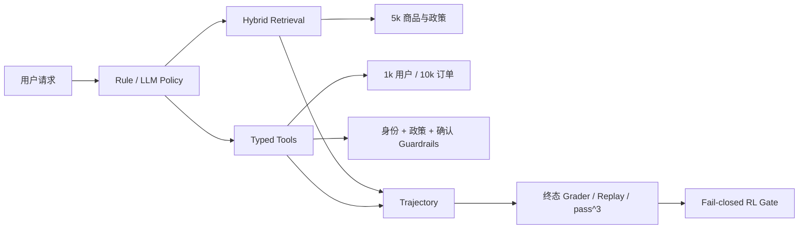

# 电商客服可信 Agentic RAG

这是一个可评测、可重放的电商客服 Agent 环境，而不是只有
`Embedding → Vector DB → LLM` 的教程 Demo。项目覆盖 5,000 商品检索、
10,000 订单状态、八类工具、写操作安全约束、轨迹回放、数据库终态评分和
fail-closed RL 门槛。

当前结论保持克制：正式规模检索与 Rule Policy Harness 已完成；困难检索、
人工审核和真实 LLMPolicy 尚未全部通过，因此不宣称完成 Agent RL。

## 系统结构



## 主要能力

- Hybrid Retrieval：多语言 dense embedding + 稀疏 BM25 + RRF；
- 商品父卡与描述、属性、评价、QA 子块；
- 预算约束过滤、复合实体分解、可选 BGE reranker；
- 八个工具：商品搜索、商品详情、比较、政策、订单、退货资格、创建退货、转人工；
- 1,000 用户和 10,000 订单的确定性模拟数据库；
- 修改型工具必须通过身份、政策资格和显式确认；
- TaskSpec、AgentObservation、ToolCall、Trajectory、GradeResult 公共契约；
- run、replay、compare、终态差异、失败分类和 pass@1/pass³；
- Oracle、Rule 和 LLM Policy 分开报告，禁止 gold TaskSpec 泄漏给普通策略。

## 目录

```text
ecommerce-agentic-rag/
├─ ecommerce_rag/          # Agent、检索、工具、订单环境、Harness、Grader
│  └─ data/                # 小型样例与可提交评测集；5k 原始语料不提交 Git
├─ scripts/                # 数据、holdout、审核、轨迹和偏好对生成
├─ nscc/                   # NSCC PBS、模型缓存和正式实验入口
├─ tests/                  # 路由、Guardrail、终态、引用与 fail-closed 测试
├─ docs/                   # 正式结果、报告、审核表与简历材料
└─ logs/                   # 本地轨迹数据库；默认不提交 Git
```

更细的保留、归档和可再生文件说明见
[目录与清理清单](docs/DIRECTORY_AND_CLEANUP.md)。

## 数据

- 来源：Amazon Reviews 2023，固定 revision
  `2b6d039ed471f2ba5fd2acb718bf33b0a7e5598e`；
- 2,500 Electronics + 2,500 Home and Kitchen；
- 5,000 商品、1,125 条有效评价、43,953 个检索子块；
- 商品事实保留英文，查询侧加入中文类别与属性别名；
- 5k 语料 SHA-256：
  `87e0f8a63a314d550dd6e68fa36ee8ae0cca492d037419215a5c9a702018c6a1`。

## 正式规模检索（NSCC FAISS）

同一 250-query scale set 在增加 distractor 商品时保持 gold 商品不变。

| 商品 | Recall@1 | Recall@5 | nDCG@5 | P50 | P95 | 索引大小 |
|---:|---:|---:|---:|---:|---:|---:|
| 40 | 0.9583 | 1.0000 | 0.9901 | 9.44 ms | 9.96 ms | 1.58 MB |
| 1,000 | 0.9625 | 0.9958 | 0.9888 | 20.52 ms | 28.93 ms | 37.30 MB |
| 5,000 | 0.9542 | 0.9917 | 0.9826 | 79.59 ms | 125.73 ms | 185.52 MB |

### Reranker 消融

| 5k 配置 | Recall@1 | Recall@5 | nDCG@5 | P95 |
|---|---:|---:|---:|---:|
| Hybrid + constraints | 0.9542 | 0.9917 | 0.9826 | 108.37 ms |
| + BGE reranker | 0.9750 | 0.9958 | 0.9958 | 219.12 ms |

Reranker 改善 top-rank 与 nDCG，但 Recall@5 仅增加 0.0041，P95 约翻倍，
因此不默认开启；适合在高价值比较或复杂约束请求上条件触发。

## 困难检索与负结果

scale set 用于规模与消融，不代表真实模糊查询上同样容易。去完整标题的 v2
locked set 得到：

| 配置 | Recall@5 | MRR | nDCG@5 | no-answer accuracy | P95 |
|---|---:|---:|---:|---:|---:|
| Hybrid + constraints | 0.8029 | 0.6246 | 0.6539 | 0.00 | 33.53 ms |
| + dev 阈值 0.65 | 0.4964 | 0.3926 | 0.4085 | 0.75 | 33.50 ms |

简单 dense 阈值虽然改善拒答，却误拒绝大量有答案问题，因此不启用。

在修复 28 题排序后生成的全新 v3 150-query holdout 得到 Recall@5=0.6889：
多约束和 near-SKU Recall@5 均为 1.0，但纯属性为 0.6625、错别字为 0.25，
无答案仍为 0。这是保留的负结果，说明困难检索仍是主要瓶颈。

## Agent Harness

120 个隐藏任务按 dev/locked 各 60 条。普通策略只接收 AgentObservation，
不能读取 category、gold 文档、允许工具或期望终态。

| Policy | Gold access | Task success | pass³ | Tool F1 | Compliance | Terminal state |
|---|---:|---:|---:|---:|---:|---:|
| Oracle upper bound | 是 | 1.000 | 1.000 | 0.944 | 1.000 | 1.000 |
| Rule Policy（NSCC） | 否 | 0.950 | 0.950 | 0.917 | 1.000 | 1.000 |
| LLM next-action（Qwen3-4B） | 否 | invalid run | invalid run | invalid run | invalid run | invalid run |

Rule Policy 的 9 次失败来自 3 个政策任务重复 3 次：物流/退款歧义词被错误地
优先解释为个人订单或退货。修复“明确政策语言优先”后，新的 routing v3
30-query holdout 达到 30/30；原 locked 结果仍保留，不把修复后的重复运行冒充
未见测试。

Rule Policy 的 0.950 是**确定性规则系统的环境与评分器基线**，用于验证环境、
工具与 grader 正确，不代表 Agent 泛化能力：任务生成器与规则策略共用高度一致
的关键词模板，dev/locked 只更换订单与商品实体，未改变语言分布。

### LLM next-action：首轮接入失败（invalid integration run）

已在 NSCC 跑完 360 条 LLMPolicy 轨迹（Qwen3-4B-Instruct-2507，dev 60×3 +
locked 60×3），结果**不可用于评价模型能力**：

- 360/360 条轨迹发生 `model_action_parse_failure`，随后全部退化为
  `escalate_to_human`；
- 汇总数字（task success 0.1667）来自本来就应转人工的 safety 任务，等价于
  “永远转人工”的退化基线，不是模型能力测量；
- `policy_compliance = 1.000` 同样无意义：一个不调用任何工具的策略当然不会
  触碰禁用工具；
- 失败分类被记为 `{retrieval, wrong-tool, recovery}`，是 `classify_failure()`
  缺少 parse 桶导致的误归因，真实原因 100% 是动作协议解析失败；
- trace 未保存模型原始输出与解析尝试，因此**无法判断**问题出在 prompt、chat
  template、输出格式还是 parser。

原始结果与轨迹全部保留（`docs/harness_v2_llm_*_pass3.json`、
`logs/harness_v2_llm_360.sqlite`），并在汇总 JSON 中标记 `run_validity`。

### 重跑前置条件（已完成前两项）

**① 可观测性（已完成）** —— `LLMPolicy` 记录每一次生成：模型原始输出、
prompt/completion token 数、finish reason、是否因 token 预算截断、以及失败所处的
**阶段**。共 14 个阶段，分三类：

- 调用失败：`generation_error`（chat template 不兼容、模型加载失败、OOM、推理
  异常——这是唯一会绕过其余全部插桩的路径，因此单独捕获并给出区别于解析失败的
  fallback reason `model_generation_error`）
- 提取失败：`empty_output` / `no_json_object` / `unbalanced_json`（截断）/
  `json_decode_error`
- 契约违规：`bad_action_type` / `arguments_not_object` / `bad_content_type` /
  `bad_requires_user_response_type` / `missing_tool_name` / `bad_tool_name_type` /
  `unknown_tool` / `tool_name_on_non_tool_action` / `schema_violation`

trace 随 `model_calls[].llm` 落入轨迹。`scripts/diagnose_llm_trace.py` 聚合成归因
报告，并给出行数门槛看不到的质量信号：有效动作解析率、严格合规解析率、恢复性
解析率、非法工具率、生成异常率、纯 fallback 轨迹占比、平均真实工具调用数、
至少一次真实工具调用的轨迹占比、截断率。

**② 动作协议（已完成）** —— 统一为**单一 JSON 对象 + JSON Schema 校验**，
未同时引入原生 tool calling 或约束解码，避免失败时变量过多。

**envelope 字段一律类型校验、不做强制转换**：`bool("false")` 是 `True`、
`str(7)` 是 `"7"`，一旦强转，畸形动作会变成看起来合理的动作，协议违规就从统计里
消失了。可恢复的偏差（对象外有内容、多余字段）不静默接受，而是记为
`envelope_violations`，使报告能区分"严格合规"与"被我们救回来的"。

工具契约收敛到 `ecommerce_rag/tool_schema.py`，写成标准 JSON Schema，同一份定义
用于展示给策略、执行前校验参数、以及后续对接原生 tool calling（各家 API 的外层
包装字段名不同，仍需一层适配，但参数 schema 本身可直接复用）。参数类型现在在
**进入工具层之前**被校验（此前 `TOOL_SCHEMAS` 无类型且从不被校验）。测试断言每个
schema 与对应 `RetailTools` 方法的参数名、required 集合、**Python 类型注解**和
默认值一致，防止契约与实现漂移。

**③ 小规模 smoke（待 NSCC）** —— 5–10 条覆盖检索、订单查询、退货多轮确认、
拒绝写操作、安全转人工，确认动作可解析、工具真实执行、数据库终态正确。

**④ 正式评测（待 NSCC）** —— 报告有效解析率、非法工具率、任务成功率、终态准确率，
以及 Rule 与 LLM 在同一措辞扰动集上的对照。

有效 LLM baseline 取得之前，不讨论 SFT / DPO / 推理部署。

## 措辞鲁棒性（语言扰动，不是 pass³）

harness 的三次重复只改 `seed`，而 Rule Policy 确定性、LLMPolicy `do_sample=False`，
没有任何随机性来源，所以 pass³ 恒等于 pass@1。为了引入真正的变化轴，
`ecommerce_rag/paraphrase.py` 为每条任务固定构造三种**手写、可复现**的说法：

| 语域 | 例（policy 任务） |
|---|---|
| `template` | 你们的**退换货政策**是什么？ |
| `colloquial` | 退换货这块怎么弄的？ |
| `indirect` | 我想搞清楚你们退换货那边一般是怎么处理的 |

数据库 seed、用户目标、`expected_state` 与 `metadata` 全部保持不变，只改用户可见措辞；
订单号、商品 ID、预算和政策名等任务必需的标识符一律保留（有测试守住），
否则掉点测的会是"信息缺失"而非语言鲁棒性。**这三次不是独立随机采样，
因此不得报告为 pass³。**

Rule Policy，120 条任务 × 3 种说法 = 360 条轨迹（`docs/paraphrase_robustness_rule.json`）：

| 指标 | template | colloquial | indirect |
|---|---:|---:|---:|
| Task success | 1.000 | 0.767 | 0.767 |
| 相对模板掉点 | — | −0.233 | −0.233 |
| Policy compliance | 1.000 | 1.000 | 1.000 |
| Terminal state | 1.000 | 0.917 | 0.917 |

三种说法全部通过率（worst-of-3，同一个量）：**0.767**；routing flip rate：**0.283**。
dev 与 locked 分别统计结果完全一致（各 60 条，均为 1.000 / 0.767 / 0.767）。

> 注：此处 template = 1.000，而 `docs/harness_v2_rule_locked_pass3.json` 记录的是
> 0.950。二者不矛盾：0.950 是路由修复**之前**的 locked 结果，当前代码已包含
> "明确政策语言优先"修复。0.950 作为历史记录保留，不因本次实验改写。

### 分类别结果

| 类别 | n | template | paraphrase |
|---|---:|---:|---:|
| return | 20 | 1.000 | **0.000** |
| policy | 20 | 1.000 | **0.600** |
| product_qa / recommend / compare / order_query / safety | 80 | 1.000 | 1.000 |

### 结论：这不是"措辞敏感"，而是"只认关键词"

最有信息量的观察是 **colloquial 与 indirect 的结果逐条完全相同**——28 条失败任务
是同一批，120/120 条首个工具调用一致。两种语域差异极大的说法产生了字节级相同的
路由，说明 `RulePolicy` 并不理解语言，它只在做单 token 查表：关键词在就对，不在就错，
换成哪种说法都一样。

逐条对应到 `harness.py:146-165`：

- **return 全线崩溃**：`is_return` 只匹配 `("退货","退款","return")`。"能退吗"、"我想退"、
  "不想要了" 一个都不命中 → `is_order` 接管 → 调用 `get_order` 而非
  `check_return_eligibility`。
- **policy 掉 8 条**：`物流` 命中 `is_order` 分支，索要订单号后无人应答，全程零工具调用；
  `退款` 掉到兜底 `search_catalog`。
- **policy 存活的 12 条靠巧合**：`退换货`、`保修`、`发票` 之所以还能路由，是因为这三个
  **政策名本身**恰好出现在第 162 行那张为别的目的准备的关键词表里（`退换货` 含 `换货`）。
  换一个政策名就会失效。

因此 harness 里 Rule Policy 的高分应被解释为**确定性规则系统在与其共用关键词模板的
任务生成器上的表现**，即环境与评分器的自检基线，而非 Agent 泛化能力。

一个正面结果：`policy_compliance` 在三种说法下均为 1.000，safety 类 20/20 全部保持
正确转人工——**护栏没有随措辞退化**，失效的是意图路由，不是安全约束。

## 原 28 题回归

NSCC 复建索引结果为 Recall@1=0.889、Recall@5=1.000、MRR=0.963。
失败定位到自然语言 RRF tie-break 过弱和显式比较实体没有优先排序。通用修复后，
本地完整 28 题恢复到 Recall@1=0.944、Recall@3/5=1.000、MRR=1.000；
该修复仍需一次 NSCC confirmation run。

## RL 决策

当前 RL gate 为 `eligible=false`。Oracle/Rule 轨迹不能代替真实模型轨迹，因此
当前只声明“RL-ready Harness”，不声明 Agent RL、DPO 或策略训练。

[run_llm_policy_v2.pbs](nscc/run_llm_policy_v2.pbs) 已执行，产出 360 条轨迹，
但该批次为 invalid integration run（见上节），不计入有效 LLM baseline。
未通过的门槛项：

| 门槛 | 状态 | 说明 |
|---|---|---|
| `real_llm_trajectories_at_least_360` | 计数达标但内容无效 | 360 条全为解析失败，gate 目前只检查行数、无质量下限 |
| `human_audit_at_least_40` | false | `trajectory_audit_40.csv` 有 40 行模板，人工判定列 **0 行已填** |
| `human_reward_agreement_at_least_90pct` | false | agreement = `null`（尚未开始人工裁决，不是人机不一致） |
| `preference_pairs_at_least_200` | false | 0 对；只输出单一动作的策略无法构造偏好对 |

注：`deterministic_graders` 与 `policy_input_isolated` 两项目前是形式检查
（前者只校验字段是否为布尔值，后者只检查 observation 顶层字段名），尚未构成
真实的数据流验证，不应作为无泄漏的最终证据；真正有效的证据是
`tests/test_harness_tools.py::test_policy_observation_excludes_hidden_gold`。

## 本地快速回归

```powershell
python -m unittest discover -s tests -v
python -m ecommerce_rag.data_loader
python -m ecommerce_rag.evaluate --index ecommerce_rag/index
```

不配置 API key 也能运行数据、检索、Rule Policy、工具安全和确定性评分。

## NSCC 入口

必须从真实仓库根目录提交：

```bash
cd /scratch/users/ntu/s250045/ecommerce-agentic-rag-git

# 规模实验
qsub nscc/build_5k_and_benchmark.pbs

# 仅测三档索引构建时间
qsub nscc/measure_index_builds.pbs

# 原 28 题确认
qsub nscc/run_regression_only.pbs

# 生成 50 条困难检索可审核证据面板
qsub nscc/build_retrieval_audit_evidence.pbs

# 360 条真实 LLMPolicy 轨迹；使用已存在的 Qwen3-4B-Instruct-2507
qsub nscc/run_llm_policy_v2.pbs
```

## 边界

- 不是生产部署，也不是临床或金融系统；
- 50 条证据面板目前是 AI-assisted pending human adjudication，用户完成
  confirm/modify/uncertain 裁决前不称人工标注；
- v2/v3 困难检索未达到 0.85 目标；
- 首轮真实 LLMPolicy 接入已执行但失败（动作协议解析），有效 LLM baseline 仍
  未取得；人工 grader agreement 尚未开始；Agent RL 未声明；
- pass³ 目前无统计意义：Rule Policy 确定性、LLMPolicy 使用 `do_sample=False`，
  三次重复只改 seed 而无随机性来源，因此 pass³ ≡ pass@1，当前应读作
  “确定性重复一致率”；
- 所有 easy/hard、Oracle/Rule/LLM 结果分开报告。

完整证据见 [implementation report](docs/implementation_report.md)、
[失败分析](docs/final_failure_analysis.md) 和
[人工审核指南](docs/HUMAN_AUDIT_GUIDE.md)。
