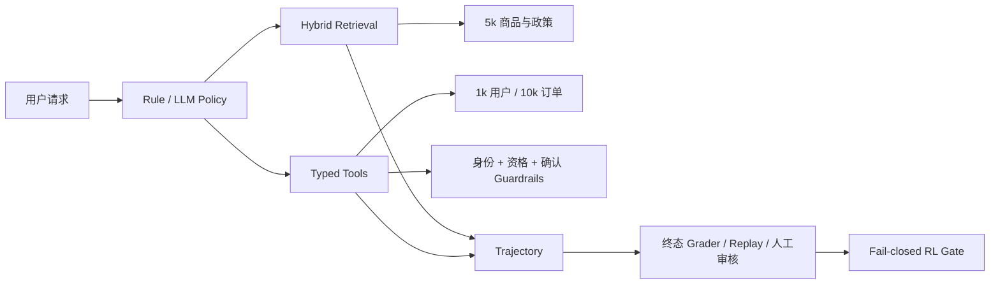

# 电商客服可信 Agentic RAG

这是一个可执行、可评测、可重放的电商客服 Agent 环境。项目覆盖 5,000 商品检索、
1,000 用户、10,000 订单、8 类 typed tools、写操作 guardrail、真实 LLM 轨迹、
数据库终态评分和人工审核。

当前结论：LLM Agent 和安全执行链路已经跑通；360 条真实轨迹的自动操作成功率为
84.17%，但 40 条系统抽样上的人工一致性未达到 90%，RL gate 未通过，因此不宣称
完成 Agent RL 或 DPO。

## 系统结构



## 主要能力

- multilingual dense embedding + BM25 + RRF hybrid retrieval；
- 商品父卡、描述、属性、评价和 QA 子块；
- 预算约束、类别过滤和可选 BGE reranker；
- 商品搜索、商品详情、商品比较、政策、订单、退货资格、创建退货、转人工工具；
- 身份验证码、退货资格和显式确认保护写操作；
- TaskSpec、AgentObservation、ToolCall、Trajectory、GradeResult 公共契约；
- run、replay、compare、终态差异、失败分类和版本化离线重评分；
- Oracle、Rule、LLM 分开报告，普通策略无法读取 gold TaskSpec 字段。

## 检索结果

固定 revision 的 Amazon Reviews 2023 语料包含 5,000 个商品、1,125 条有效评价和
43,953 个子块。5k FAISS scale set：

| 配置 | Recall@1 | Recall@5 | nDCG@5 | P95 |
|---|---:|---:|---:|---:|
| Hybrid + constraints | 0.9542 | 0.9917 | 0.9826 | 108.37ms |
| + BGE reranker | 0.9750 | 0.9958 | 0.9958 | 219.12ms |

Reranker 改善首位排序，但延迟约翻倍，因此不默认开启。

规模集不代表模糊查询能力。独立 v3 困难集 Recall@5=0.6889，其中纯属性为
0.6625、typo/alias 为 0.25、no-answer accuracy 为 0。这些是当前检索局限。

## 360 条真实 LLM 轨迹

Qwen3-4B 在 120 个任务上以确定性解码运行 3 次，共 360 条轨迹。原始 SQLite
保持不变，新评分通过 sidecar 保存。

| v2 自动操作指标 | 全部 | dev | locked |
|---|---:|---:|---:|
| operational success | 84.17% | 83.33% | 85.00% |
| policy compliance | 95.00% | 95.00% | 95.00% |
| terminal-state accuracy | 100% | 100% | 100% |
| forbidden-tool attempt | 5.00% | 5.00% | 5.00% |
| illegal state change | 0% | 0% | 0% |

这些是自动化操作指标，不包含对最终回答完整性、事实忠实度和推荐质量的全面判断。
旧评分器记录的 94.17% 作为历史操作分保留，不作为人工验证的真实成功率。

原始 21 条自动失败来自 7 个唯一任务：12 条是政策类别接口问题，9 条是将外部型号
误当内部商品 ID。它们不能统一解释为 embedding 召回失败。

## 人工审核与 RL 决策

40 条轨迹采用排序后固定步长抽样，不是随机样本，因此审核比例不外推到全部 360 条：

- 人工 success verdict：20/40；
- 人工 policy-compliant verdict：25/40；
- v2 success agreement：80.0%；
- v2 policy agreement：77.5%；
- preference pairs：0。

Gate 当前为 `eligible=false`。Guardrail 令非法数据库变更为 0，但 5% 的轨迹仍
尝试了禁止工具，所以“终态安全”和“Agent 决策合规”必须分开报告。

完整结论见 [360 条评测收尾](docs/evaluation_closeout_v2.md)。

## 工具契约

- `get_product.product_id` 只接受内部编号 `P[0-9]{5}`；商品名、型号和 SKU 必须先搜索；
- `get_policy.policy_type` 使用 `return | warranty | shipping | invoice | refund`；
- 工具层将政策类型映射到精确语料类别，同时兼容已有中文调用方；
- JSON Schema 在工具执行前校验类型、pattern 和 enum。

下一次模型运行只覆盖已识别的 7 个唯一失败任务，确认工具契约后再决定是否扩量。

## 本地验证

```powershell
python -m unittest discover -s tests -v

python -m scripts.regrade_trajectories `
  --tasks ecommerce_rag/data/harness_tasks_v2.jsonl `
  --store logs/harness_v2_llm_360.sqlite `
  --output-grades logs/harness_v2_llm_360_grades_v2.jsonl `
  --output-report docs/harness_v2_llm_360_regraded_v2.json

python -m ecommerce_rag.rl_gate `
  --tasks ecommerce_rag/data/harness_tasks_v2.jsonl `
  --store logs/harness_v2_llm_360.sqlite `
  --grades logs/harness_v2_llm_360_grades_v2.jsonl `
  --audit docs/trajectory_audit_40.csv `
  --preference-pairs logs/action_preferences.jsonl `
  --output docs/agent_rl_gate_regraded_v2.json
```

## 边界

- 不是生产部署；
- 自动操作评分不替代自然语言答案审核；
- 40 条系统抽样不是总体成功率估计；
- 确定性三次重复不能解释为独立随机试验的 pass³；
- RL gate 未通过，不声明 DPO/PPO/GRPO；
- easy/hard、Oracle/Rule/LLM 结果始终分开报告。
