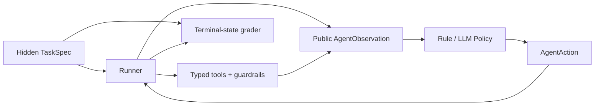

# Credible evaluation report

## What changed

The earlier 100% harness score was an environment smoke test: its deterministic
policy could read the complete `TaskSpec`. The v2 runner now keeps gold documents,
allowed tools, expected state, category and hidden user behavior inside the grader.
Normal policies receive only `AgentObservation`; the privileged policy is explicitly
named `OraclePolicy` and reported separately.

## Locked agent results

The locked split contains 60 unseen tasks and is repeated three times.

| Policy | Gold access | Task success | pass^3 | Tool F1 | Compliance | Terminal state |
|---|---:|---:|---:|---:|---:|---:|
| Oracle upper bound | yes | 1.000 | 1.000 | 0.944 | 1.000 | 1.000 |
| Leakage-free rules | no | 0.950 | 0.950 | 0.917 | 1.000 | 1.000 |
| LLM next-action | no | pending | pending | pending | pending | pending |

The rule failures are nine repeated `wrong-tool` grades over three seeds. Oracle
results validate task feasibility; they are not presented as Agent performance.

## Title-debiased retrieval v2

The 300-query set has no complete-title questions: 180 corpus-unique attributes,
40 budget/multi-constraint, 30 alias/typo, 25 multi-gold near-SKU and 25 no-answer.
The 120 difficult rows remain `curated_unverified`, not human-verified.

| Locked configuration | Recall@5 | MRR | nDCG@5 | P50 | P95 |
|---|---:|---:|---:|---:|---:|
| Hybrid + constraints, raw | 0.803 | 0.625 | 0.654 | 26.4ms | 33.5ms |
| + dev-calibrated abstention threshold 0.65 | 0.496 | 0.393 | 0.409 | 25.4ms | 33.5ms |

The threshold correctly abstains on 75% of locked no-answer queries but rejects too
many answerable queries. This is a negative calibration result, not a default-on
feature. Recall@5 also misses the 0.85 target; failures concentrate in attribute-only
and typo queries. The previous 0.965 score is retained only as the easy regression set.

The sparse inverted BM25 path reduces the 5k P95 from about 1.06s to 33.5ms locally.
FAISS `IndexFlatIP` is enabled automatically where `faiss-cpu` is available; this
Windows/Python 3.13 run used the exact NumPy fallback, so no FAISS speed claim is made.

## RL decision

`agent_rl_gate_v2.json` fails closed. It requires 360 real `LLMPolicy` trajectories,
40 audited rows, at least 90% grader/human agreement, 200 preference pairs and a base
success rate below 95%. Oracle/rule trajectories do not satisfy the gate; Agent RL is
therefore not claimed.
